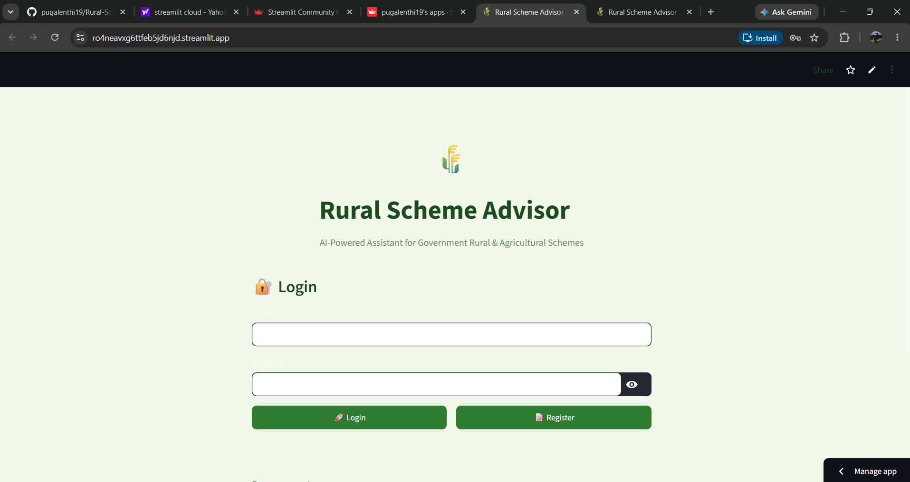
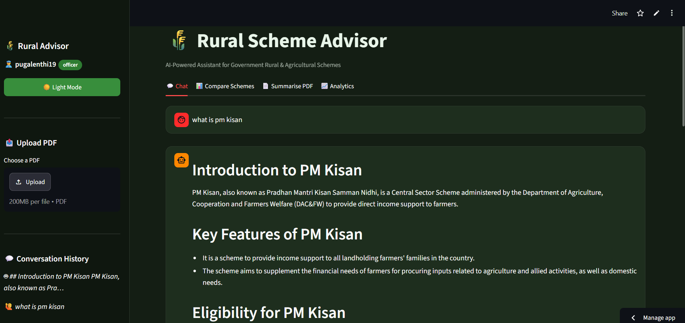
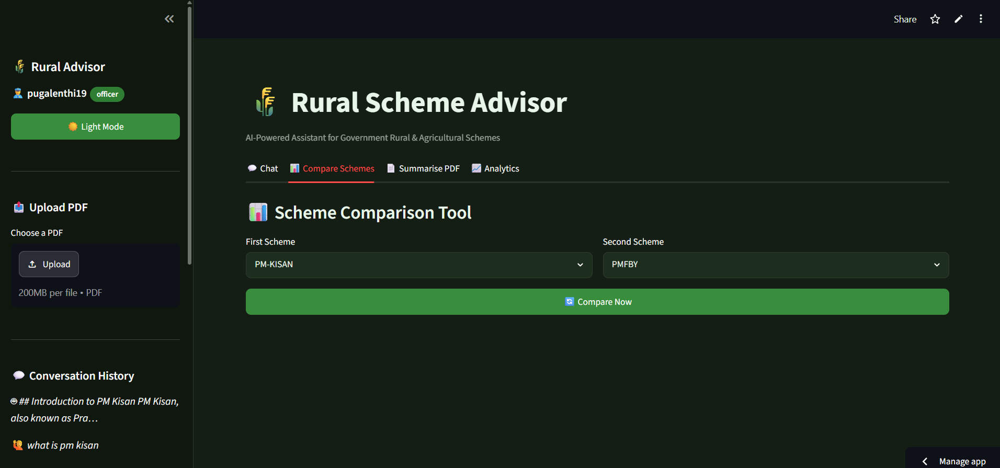
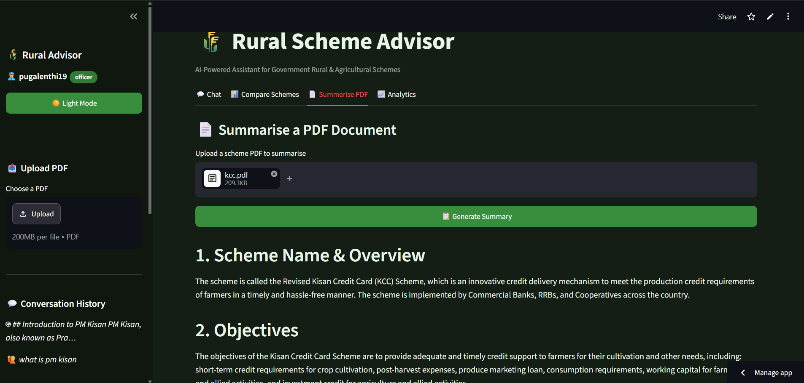
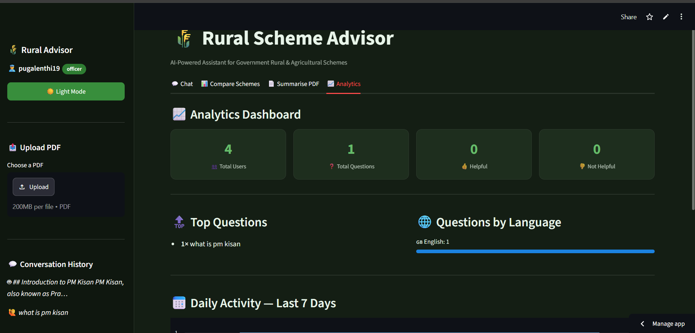

# 🌾 Rural Scheme Advisor

An AI-powered assistant that helps users learn about Indian Government Rural and Agricultural Schemes using **Retrieval-Augmented Generation (RAG)**. The application provides accurate, document-based answers from official government scheme PDFs.



---

## 🚀 Live Demo

🔗 https://ro4neavxg6ttfeb5jd6njd.streamlit.app

---

## 📌 Project Overview

Rural Scheme Advisor is an intelligent AI chatbot built using **LangChain**, **ChromaDB**, **Groq LLM**, and **Streamlit**.

The application retrieves relevant information from official government scheme documents and generates accurate responses using Retrieval-Augmented Generation (RAG). It automatically builds the vector database from the bundled PDFs during deployment, so users can start asking questions without uploading any documents.

---

## 🌟 Project Highlights

- 🤖 AI-powered chatbot using Retrieval-Augmented Generation (RAG)
- 📚 Automatic vector database creation from government scheme PDFs
- 🔍 Semantic search using ChromaDB and Hugging Face embeddings
- ☁️ Deployed on Streamlit Community Cloud
- 🔐 Secure API key management using Streamlit Secrets
- 📄 No manual PDF upload required after deployment

---

## ✨ Features

- 🤖 AI-powered chatbot using Groq LLM
- 📚 Retrieval-Augmented Generation (RAG)
- 📄 Automatic PDF ingestion
- 🔍 Semantic search using ChromaDB
- 🧠 Hugging Face sentence embeddings
- 📊 Scheme comparison
- 📝 PDF summarization
- 💾 SQLite database for analytics
- 🔐 Secure API key management
- ☁️ Cloud deployment using Streamlit Community Cloud

---

## 🛠️ Tech Stack

| Category | Technology |
|----------|------------|
| Language | Python |
| UI | Streamlit |
| LLM | Groq |
| Framework | LangChain |
| Vector Database | ChromaDB |
| Embeddings | Hugging Face (all-MiniLM-L6-v2) |
| Database | SQLite |
| Version Control | Git & GitHub |
| Deployment | Streamlit Community Cloud |

---

## 📂 Project Structure

```text
Rural-Scheme-Advisor/
│
├── app.py
├── database.py
├── ingest.py
├── rag.py
├── requirements.txt
├── README.md
│
├── data/
│   ├── pmkisan.pdf
│   ├── kcc.pdf
│   ├── pmfby.pdf
│   ├── enam.pdf
│   └── pmkmy.pdf
│
├── screenshots/
│   ├── home.png
│   ├── chatbot.png
│   ├── comparison.png
│   ├── summarisation.png
│   └── analytics.png
│
└── vectorstore/
```

---

## ⚙️ Installation

### Clone the repository

```bash
git clone https://github.com/pugalenthi19/Rural-Scheme-Advisor.git

cd Rural-Scheme-Advisor
```

### Install dependencies

```bash
pip install -r requirements.txt
```

### Create a `.env` file

```env
GROQ_API_KEY=YOUR_GROQ_API_KEY
GOOGLE_API_KEY=YOUR_GOOGLE_API_KEY
```

### Run the application

```bash
streamlit run app.py
```

---

## 📷 Screenshots

### 🏠 Home Page


---

### 💬 Chat Interface



---

### 📊 Scheme Comparison



---

### 📄 PDF Summarization



---

### 📈 Analytics Dashboard



---

## 📖 System Workflow

```text
Government Scheme PDFs
          │
          ▼
      PDF Loader
          │
          ▼
     Text Chunking
          │
          ▼
 Hugging Face Embeddings
          │
          ▼
 Chroma Vector Database
          │
          ▼
       Retriever
          │
          ▼
       Groq LLM
          │
          ▼
 AI Generated Response
```

---

## 🔒 Security

- API keys are securely stored using Streamlit Secrets.
- Sensitive files such as `.env` are excluded using `.gitignore`.
- Vector database is automatically generated during deployment from the bundled PDFs.

---

## 🚀 Future Enhancements

- Support additional government schemes
- OCR support for scanned PDF documents
- Multilingual interface
- Mobile-friendly UI
- Admin dashboard for document management

---

## 👨‍💻 Author

**Taranjayavarman K S**

B.Tech Electronics & Communication Engineering

SASTRA Deemed University

GitHub: https://github.com/pugalenthi19

---

## ⭐ Support

If you found this project useful, please consider giving it a ⭐ on GitHub.